```mermaid
graph LR
    A[PSteczka] --> B[Languages]
    A --> C[Frameworks]
    A --> D[Tools]
    
    B --> B1[C/C++/C#]
    B --> B2[Python/Java]
    B --> B3[JS/PHP]
    
    C --> C1[Node/Laravel]
    C --> C2[Flutter]
    
    D --> D1[Docker]
    D --> D2[AI Tools]
    
    style A fill:#15d8fe
    style B fill:#1a1a1a
    style C fill:#1a1a1a
    style D fill:#1a1a1a
```

<!-- Minimalist Header with Neon Accent -->
<div align="center">
  
  
  # PSteczka
  
  <p align="center">
    
  </p>
</div>

```css
.status {
  position: "Poland 🇵🇱";
  current: "Building the future";
  mood: "Caffeinated ☕";
}
```

<div align="center">
  
  
  
</div>

<br>

<!-- Interactive Terminal -->
<div align="center">

```bash
> psteczka.current_status()
=> "Writing code that doesn't need comments"

> psteczka.skills.list()
=> ["Everything", "...but especially:", "C/C++", "Python", "JS/TS", "And 42 others"]

> psteczka.contact()
=> pawell.chodup@gmail.com
```

</div>

---

### `<Tech Stack>`



---

### `<GitHub Matrix>`

<div align="center">
  
</div>

---

### `<Real-Time Stats>`

<div align="center">
  <table>
    <tr>
      <td align="center">
        
      </td>
      <td align="center">
        
      </td>
    </tr>
  </table>
</div>

---

### `<Latest Activity>`

```typescript
const recentActivity = {
  "⚡": "Pushed 3 commits to legolasek/awesome-project",
  "🎯": "Opened PR #42 in some-org/some-repo",
  "✨": "Created new repository legolasek/secret-project",
  "🔥": "Started 10 discussions"
};
```

---

### `<Connect>`

<div align="center">
  
  [](https://github.com/legolasek)
  [](https://discord.com/users/psteczka)
  [](https://youtube.com/@psteczka)
  
</div>

---

### `<Support>`

<div align="center">
  <a href="https://www.buymeacoffee.com/psteczka">
    
  </a>
</div>

---

<div align="center">
  <sub>Built with 💙 and probably too much ☕ in 2025</sub>
  
  <br>
  
  
</div>
